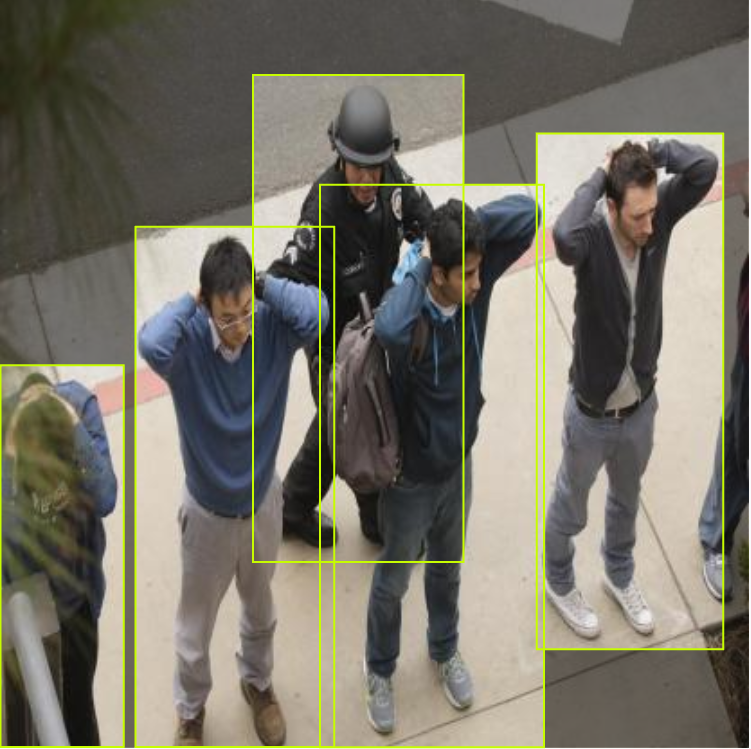
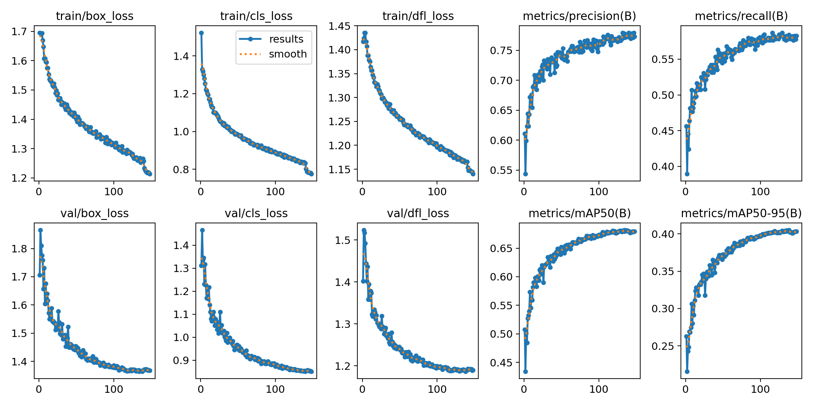
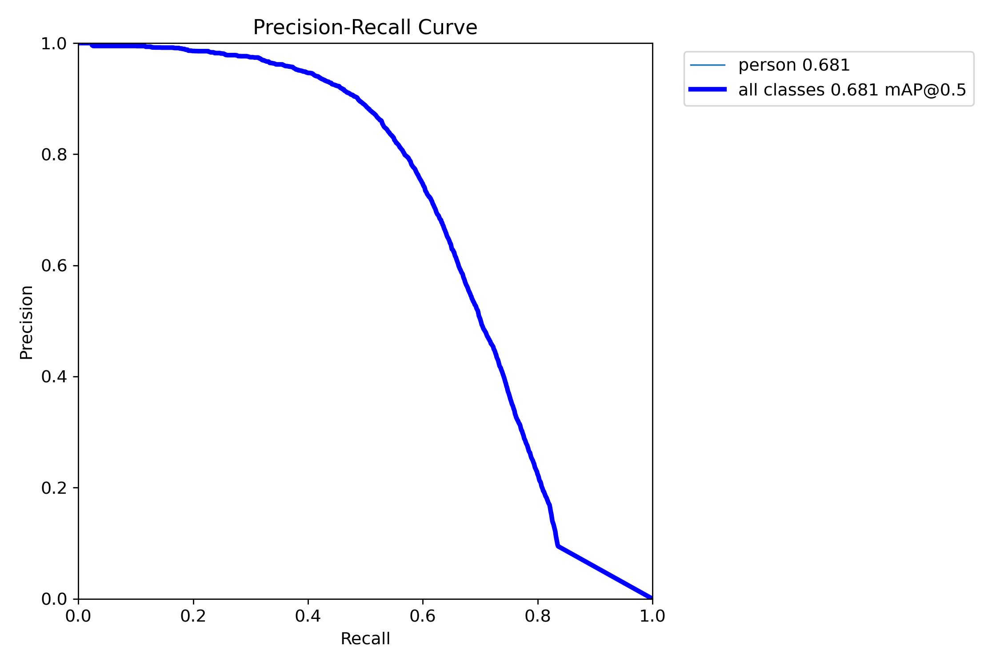
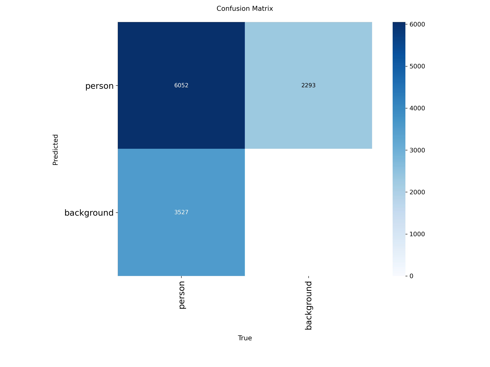
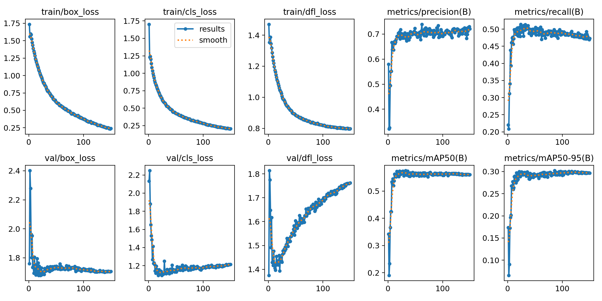
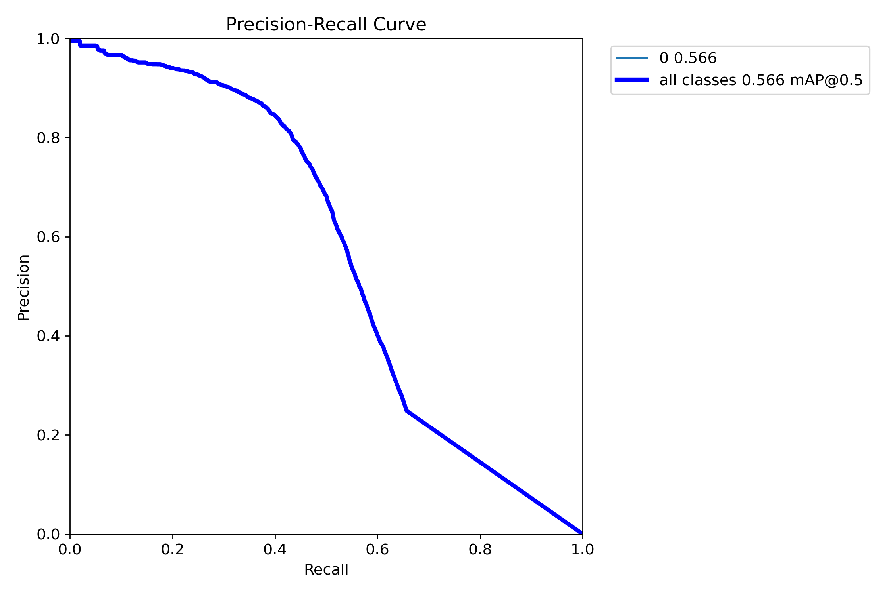
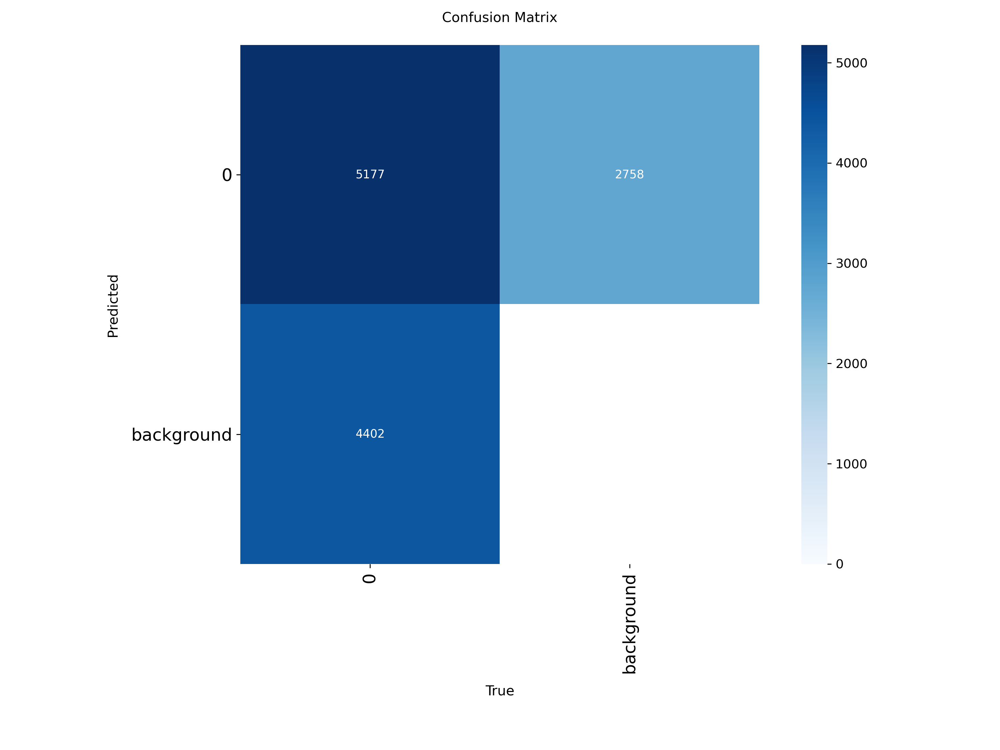
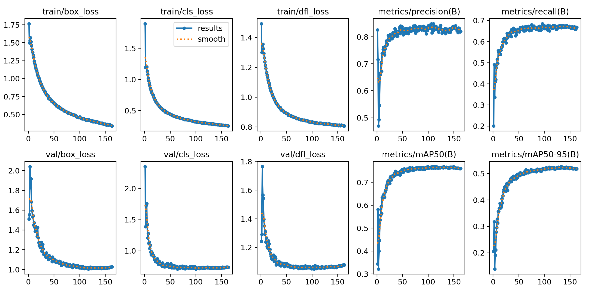
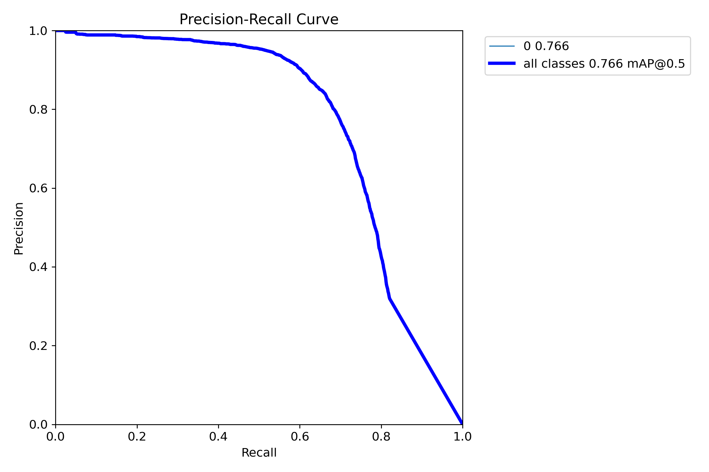
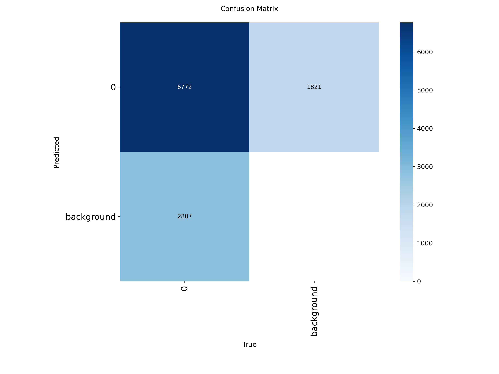

# Person Detection with YOLOv8

## Dataset

Para entrenar el detector de personas se ha utilizado el dataset **persons Computer Vision Dataset**, disponible en Roboflow Universe:

https://universe.roboflow.com/enova/persons-gfzae

El dataset contiene **3875 imágenes anotadas**, **una única clase (person)** y está compuesto por escenas **indoor** y **outdoor**, donde aparecen personas en diferentes condiciones de iluminación, distancias y perspectivas. 

Cada instancia de la clase *person* está anotada mediante **bounding boxes**. 

Una característica destacable de este dataset es que cada imagen suele contener **múltiples personas**, generando un gran número de **bounding boxes por imagen**. Además, muchas de estas detecciones corresponden a personas parcialmente visibles, pequeñas o en segundo plano, lo que introduce anotaciones **más sutiles y difíciles de detectar**. Esto hace que el dataset sea **completo y desafiante**, ya que el modelo debe detectar personas en **escenarios densos** y con **oclusiones**, mejorando así la robustez del detector.

El dataset se divide en:
- **3175 imágenes para entrenamiento**
- **400 imágenes para validación**
- **300 imágenes para test**

Roboflow permite exportar el dataset en **formato YOLO**, lo que facilita su integración directa con modelos como YOLOv8.

### Data Leakage Experiment

Para analizar el impacto del **data leakage**, se creó una segunda versión del dataset en la que se añadieron las **400 imágenes del conjunto de validación al conjunto de entrenamiento**. De esta forma, el modelo tiene acceso durante el entrenamiento a ejemplos que también aparecen en validación, simulando una situación de **fuga de información entre splits**.

Tras esta modificación, el conjunto de entrenamiento pasa a tener **3575 imágenes**, mientras que los conjuntos de validación y test se mantienen sin cambios. Este experimento permite observar cómo el *data leakage* puede producir **métricas de validación artificialmente optimistas**, ya que el modelo se evalúa sobre datos que ya ha visto durante el entrenamiento.

### Dataset Summary
| Feature | Original dataset | Dataset with leakage |
|-------|------------------|----------------------|
| Total images | 3875 | 4275 |
| Classes | 1 (person) | 1 (person) |
| Training images | 3175 | 3575 |
| Validation images | 400 | 400 |
| Test images | 300 | 300 |
| Annotation type | Bounding boxes | Bounding boxes |
| Format | YOLO | YOLO |

## Training YOLO

Debido a la falta de disponibilidad de hardware local adecuado, los entrenamientos se realizaron en **Google Colab**, lo que permitió utilizar **aceleración por GPU**. No obstante, el entorno presenta limitaciones de tiempo de uso y las sesiones se interrumpían al alcanzar el límite de ejecución. Esto obligó a priorizar entrenamientos relativamente cortos para evitar perder el progreso del entrenamiento.

Como consecuencia de estas restricciones, se utilizó el modelo **YOLOv8n** y se limitaron el número de **épocas de entrenamiento**. Aun así, cada entrenamiento tuvo una duración aproximada de **más de dos horas**.

Se realizaron **tres entrenamientos diferentes**:

- **Entrenamiento base (óptimo)**: realizado con el **dataset original** y las **técnicas de data augmentation por defecto** de YOLOv8. 

- **Entrenamiento con overfitting**: realizado con el **dataset original** y **data augmentation pobre**. Debido a las limitaciones de tiempo de Google Colab no fue posible realizar un entrenamiento más largo.

- **Entrenamiento con data leakage**: realizado con el **dataset modificado** y **data augmentation pobre**, donde las imágenes de validación se añadieron al conjunto de entrenamiento.

A continuación se muestran las curvas de entrenamiento generadas por YOLOv8 para los tres entrenamientos realizados. Cada gráfico resume la evolución de las **losses de entrenamiento y validación**, así como las principales **métricas de evaluación** (precision, recall y mAP). Además, se incluyen las **curvas Precision–Recall (PR)** y las **matrices de confusión**.

### 1. Baseline Training (dataset original + augmentations por defecto)

  
  

### 2. Overfitting Training (dataset original + augmentation reducido)

  
  

  
  
</p

## Demo Person Detector Outdoor-Indoor (Baseline Model)

La **evaluación del modelo** sobre vídeos de prueba muestra que el detector identifica las personas presentes con **alta precisión**. Esto sugiere que las métricas de validación pueden estar penalizadas por la **dificultad intrínseca del dataset**, caracterizado por **escenas densas**, **personas de pequeño tamaño** y **frecuentes oclusiones**, más que por una falta de capacidad del modelo. Al aplicarlo a vídeos de escenas más habituales, el detector demuestra una **buena capacidad de generalización**, habiendo aprendido **representaciones robustas para la detección de personas**.

 

 
